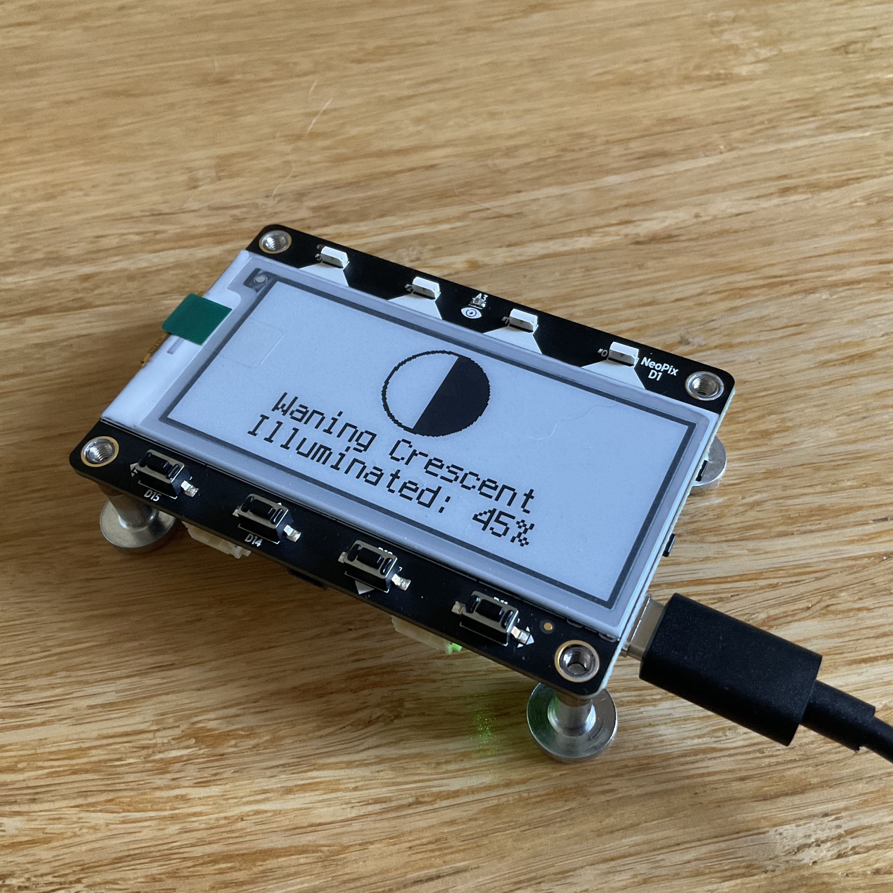
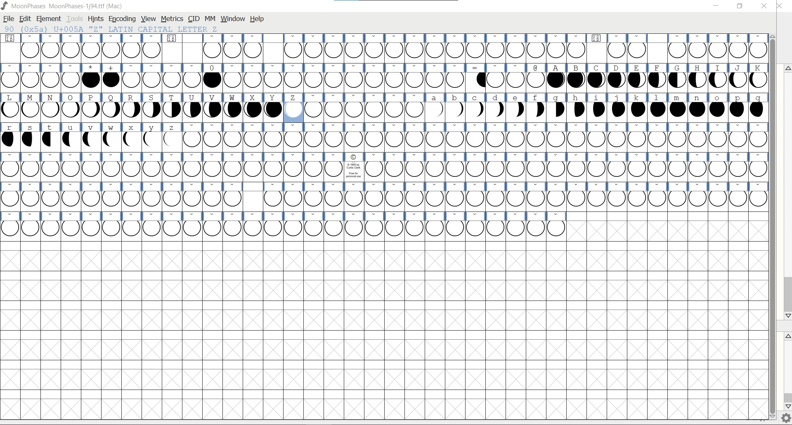

Adafruit MagTag Moon Phase
===========

brief history
-------------------
I got the magtag in an Adabox, I love the tides and weather examples and thought MoonPhase would make a lovely addition as I would want that data at my families summer home too.

I tried originally porting the MatrixPortal example, but the MagTag cannot store 100 bmps for moon phases, I then realized I could port Curtis Clark's MoonPhase typeface to a compatible font using FontForge, and finally found Farmsense as an easy API to pull Moon Data from. 

I am sharing this code in hopes others can use/tinker, and to back it up, I hope to comeback to this project before the summer. It needs to be cleaned up and tinkered with. For instance, there are fewer characters in the typeface than days in the Moons age, so the visual icon for the moon will be off a bit. 

toDo
-------------------
- [ ] smooth out phases for ~45% illum (still at 50% bmp)
- [ ] maybe Dawn / Dusk timings?
- [ ] better UI (maybe similar to tide or weather)
- [ ] figure out Deep Sleep
- [ ] Tutorial?
- [ ] Clean up code (rm unneeded, comment out)
- [ ] Include in project selector w/ tides and weather

Parts needed
-------------------
* Adafruit Magtag: ([MagTag](https://en.wikipedia.org/wiki/Game_Boy_Advance_SP#/media/File:Nintendo-Game-Boy-Advance-Headphone-Adapter.jpg))
* USB C cable

Repository Contents
-------------------
* **/Archive** - Test files
* **/fonts** - font files, only one in use currently
* **Secrets.py** - Really only need wifi info to my knowledge
* **MoonPhase.py** - rename to code.py for your MagTag

You will want to download the following into /lib on your MagTag, I am sure not all are needed and I need to clean up this list...

* adafruit_bitmap_font
* adafruit_display_text
* adafruit_io
* adafruit_magtag
* adafruit_portalbase
* adafruit_fakerequests.mpy
* adafruit_requests.mpy
* neopixel.mpy
* simpleio.mpy

Links/Sources
-------------------
* [Creating MagTag Projects](https://learn.adafruit.com/creating-magtag-projects-with-circuitpython)
* [Farmsense Astral API](https://www.farmsense.net/api/astro-widgets/)
* [Curtis Clark's Moon Typface](http://www.mockfont.com/old/n)

 

people
-------------------
* bk brandonklevence@gmail.com

License Information
-------------------
Please obviously follow source licenses:
* Adafruits hardware and code example licenses.
* Farmsense also has it's own licenses. 
* Curtis Clarks license asks you to keep it non-commercial! 
* you buy me a beer if you use this and we meet someday ([Beerware license](http://en.wikipedia.org/wiki/Beerware)).
